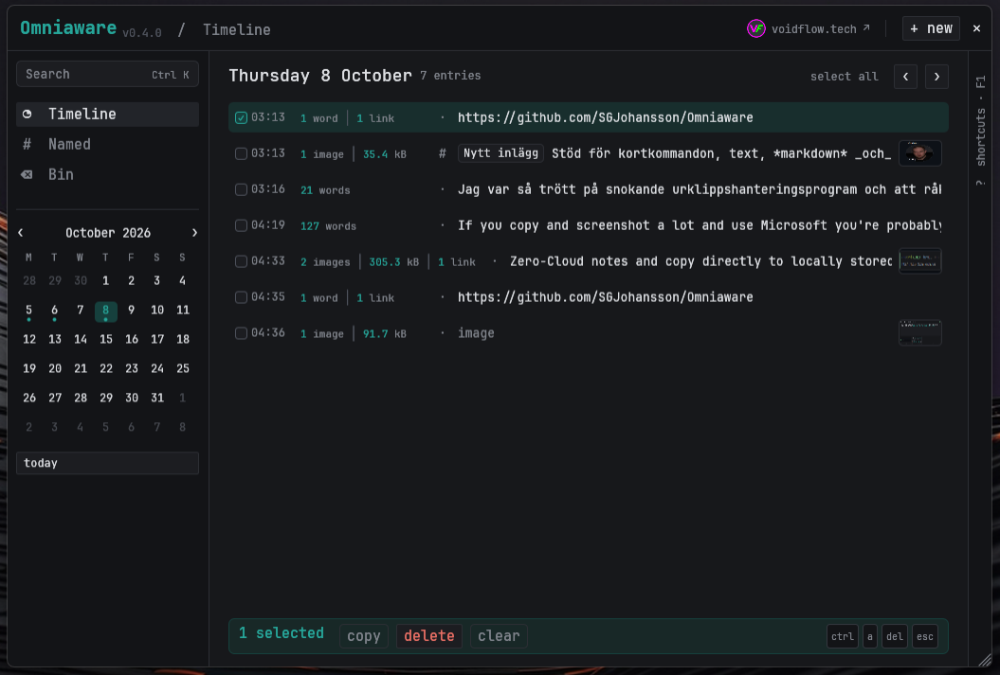
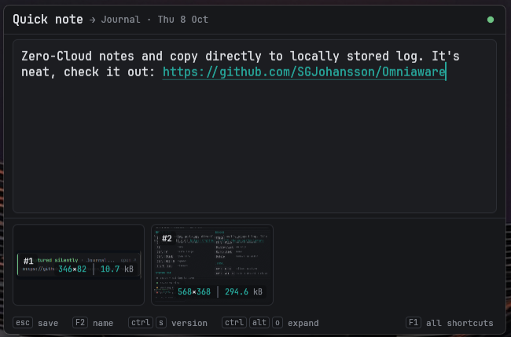
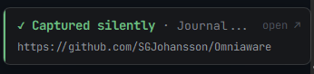

# Omniaware

A lightweight, keyboard-first home for everything I don't want to lose: clipboard snippets, quick notes, links, screenshots and journal entries — captured in a keystroke and laid out on a timeline.

I built Omniaware to replace a patchwork of AutoHotkey pop-ups, a separate Markdown editor and browser-based note tools. The goals are simple: it should be there the instant I need it, stay out of the way when I don't, and never lose a single character — not even on a power cut.

> **Status:** early development (v0.4). Windows 10/11 only. The interface is in British English.



## Features

<p align="center">
  
  &nbsp;
  
</p>
<p align="center"><sub>The capture popup (<code>Ctrl+Alt+O</code>) and the notice after a silent capture (<code>Ctrl+C</code> <code>C</code>).</sub></p>

- **Silent capture** — press `Ctrl+C` twice in quick succession and the clipboard (text or image) is saved straight to today's journal. The tray icon briefly turns green; nothing else interrupts you.
- **One key for everything else** — `Ctrl+Alt+O` opens a small capture window pre-filled with the clipboard. Press it again and the same note expands into the main window: a day-by-day timeline, a month calendar marking days with content, named entries and a recycle bin. Press it a third time to put everything away.
- **Search** — `Ctrl+K` searches everything. Words match anywhere inside words (`affe` finds *Kaffekannor*), `*` and `?` are wildcards, and `/…/` takes a full regular expression. Each hit shows the matching line with the match highlighted; `Shift+Enter` pastes the result straight into the window you came from.
- **Tidy up in bulk** — every list supports `Ctrl`+click, `Shift`+click and `Ctrl+Shift`+click selection, `Ctrl+A` selects the whole list on screen, and `Delete` moves the selection to the bin. The bin can restore, delete forever or be emptied.
- **A word when it's saved** — closing a note or capturing silently shows a small notice above the system tray (what was saved, where, and how much). Click it to open the entry; hover to keep it.
- **Markdown and links** — entries are plain Markdown. The editor highlights headings, **bold**, *italics*, `code`, lists, task boxes and quotes as you type, and every web, FTP, file or `mailto:` address becomes a link (`Ctrl`+click to open). `Ctrl+E` shows the rendered preview.
- **Images** — pasted images are kept as attachments shown above the text; an image-only entry is displayed full size with the text as its caption. Every image is numbered and shows its dimensions and file size; hover for the full details. Pasting a picture that is already attached asks before adding it as a copy (the file is shared, not duplicated). Click to select (`Ctrl`+click for several, `Delete` removes), double-click to enlarge, right-click to copy, save, open with another program or show the file in Explorer.
- **Named snippets** — give an entry a name (`F2`) and it becomes a reusable snippet, much like an AutoHotkey text store. `Enter` or `Tab` takes you straight back to the text.
- **At a glance** — the timeline shows each entry's word count, number of images, size on disk and links next to the time.
- **Crash-safe by design** — see [Data and durability](#data-and-durability).

## Keyboard shortcuts

**Global**

| Shortcut | Action |
|---|---|
| `Ctrl+C` `C` | Save the clipboard silently (hold `Ctrl`, tap `C` twice) |
| `Ctrl+Alt+O` (or `AltGr+O`) | 1st press: capture popup · 2nd: expand to the main window · 3rd: close |
| Tray icon click | Capture popup |

**Capture popup**

| Shortcut | Action |
|---|---|
| `Esc` | Save and close (empty entries are discarded) |
| `Ctrl+Alt+O` | Keep the note and expand to the main window |
| `Shift+Esc` | Move to the recycle bin |
| `Ctrl+S` | Save a version now |
| `F2` | Name the entry. `Enter` / `Tab` back to the text, `Ctrl+Enter` name and close. If the name is taken, `Enter` again moves it here; the previous entry is kept, unnamed |
| `F1` (hold or click) | Show all shortcuts; the most common ones are always listed along the bottom |
| `Ctrl+V` | Paste text or an image |
| `Ctrl`+click | Open a link |

**Main window**

| Shortcut | Action |
|---|---|
| `←` `→` / `T` | Previous / next day / today |
| `Ctrl+K` | Search. `Enter` opens, `Shift+Enter` pastes into the previous window |
| `Ctrl+N` | New entry |
| `Ctrl+E` | Toggle edit / preview |
| `Ctrl`+click | Open a link |
| `Ctrl+S` / `F2` | Save a version / name the entry |
| `Ctrl`+click / `Shift`+click | Select entries / a range |
| `Ctrl+A` · `Delete` | Select the whole list · move the selection to the bin |
| `F1` | Show or hide the shortcut panel |
| `Esc` | Back, then close |

Shortcuts can be changed in `config.toml`.

## Installation

### Download

Pre-built binaries are published on the [Releases](https://github.com/SGJohansson/Omniaware/releases) page. Download `omniaware.exe` and run it — no installer, no dependencies. To start it with Windows, place a shortcut in `shell:startup`.

### Build from source

Requires the Rust toolchain and the MSVC build tools:

```powershell
winget install Rustlang.Rustup
winget install Microsoft.VisualStudio.2022.BuildTools --override "--quiet --add Microsoft.VisualStudio.Workload.VCTools --includeRecommended"

git clone https://github.com/SGJohansson/Omniaware.git
cd Omniaware
cargo build --release
.\target\release\omniaware.exe
```

## Data and durability

Everything lives locally in `%APPDATA%\Omniaware\` (override with the `OMNIAWARE_DATA` environment variable). Nothing is sent anywhere.

| File | Contents |
|---|---|
| `omniaware.db` | All entries, revision history and the search index (SQLite) |
| `blobs\` | Images, stored content-addressed by their BLAKE3 hash |
| `config.toml` | Settings; created with defaults on first start |
| `omniaware.log` | Errors, if any |

How it avoids losing data:

- The clipboard is written to the database **before** the capture window is even shown.
- Edits are saved 300 ms after the last keystroke (a short pulse on the status dot), in SQLite WAL mode with `synchronous=FULL` (every commit is flushed to disk).
- A revision snapshot is kept each time an entry is closed.
- Images are written to a temporary file, flushed and then atomically renamed.
- Deleting moves entries to a recycle bin; permanent removal requires a second confirmation.

## Configuration

```toml
renderer = "wgpu"            # "glow" switches to OpenGL if the GPU driver misbehaves

[hotkeys]
capture = "ctrl+alt+KeyO"    # modifiers: ctrl / alt / shift / super
main = ""                    # optional direct shortcut to the main window

[window]
width = 640.0                # capture popup
height = 420.0
font_size = 14.0
main_width = 1040.0
main_height = 700.0
```

## Roadmap

- Events with natural-language dates in Swedish (`imorgon 14 tandläkare`), a full calendar view and reminders
- Desktop post-it notes
- An aggregated to-do view built from Markdown task lists
- Optional encrypted backup to a self-hosted server

## Built with

[Rust](https://www.rust-lang.org/), [egui](https://github.com/emilk/egui), [SQLite](https://sqlite.org/) via rusqlite, and the [JetBrains Mono](https://www.jetbrains.com/lp/mono/) typeface.

## Author

Made by S.G. Johansson — [voidflow.tech](https://voidflow.tech/).

## License

Omniaware is released under the [MIT License](LICENSE). JetBrains Mono is bundled under the [SIL Open Font License 1.1](assets/fonts/LICENSE-JetBrainsMono.txt).
